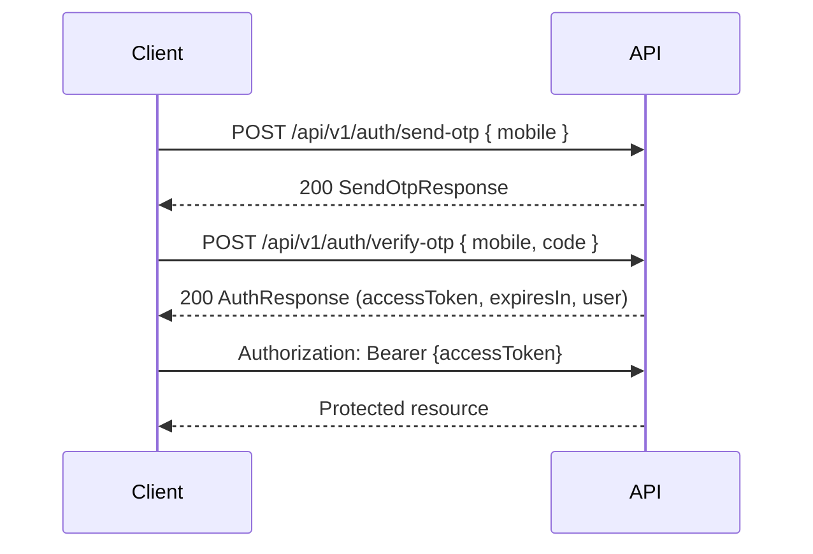

# Authentication

HelpDev uses **mobile OTP + JWT Bearer**. There is no OAuth, API keys, or social login.

## Flow



Legacy unversioned paths `/api/auth/send-otp` and `/api/auth/verify-otp` behave identically.

## Request OTP

**`POST /api/v1/auth/send-otp`**

Request body (max **16 KB**):

```json
{ "mobile": "09120000000" }
```

Response (`SendOtpResponse`):

| Field | Description |
|-------|-------------|
| `message` | Confirmation text |
| `expiresInSeconds` | OTP validity window (default config: 5 minutes) |
| `otp` | Present only when `Auth:ExposeOtpInResponse=true` (non-production); **never in Production** |

Dedicated **OtpRequest** rate limits apply. OTP resend, verification attempt, and expiration limits are enforced server-side.

## Verify OTP

**`POST /api/v1/auth/verify-otp`**

Request body (max **16 KB**):

```json
{ "mobile": "09120000000", "code": "123456" }
```

Response (`AuthResponse`):

| Field | Description |
|-------|-------------|
| `accessToken` | JWT for subsequent requests |
| `expiresIn` | Token lifetime in **seconds** (from `Jwt:ExpirationMinutes`, default 60) |
| `user` | Profile summary including `role` |

Failed verification attempts are counted (`Otp:MaxFailedAttempts`, default 5). Invalid or expired codes return **400**.

Database unavailability during verify may return **503**.

## Using the JWT

Send on every protected request:

```http
Authorization: Bearer {accessToken}
```

- Scheme: `Bearer` (HTTP auth, not a query parameter)
- Algorithm: HMAC-SHA256
- Issuer / audience: configured via `Jwt:Issuer` and `Jwt:Audience` (defaults: `HelpDev`, `HelpDev.Client`)
- Clock skew tolerance: 1 minute

When the token expires, obtain a new one via OTP verify. There is no refresh-token endpoint in v1.

## Roles

JWT includes a role claim. Application roles:

| Role | Typical use |
|------|-------------|
| `User` | Default authenticated user |
| `Writer` | Content and course management |
| `Admin` | Full admin API |

Admin endpoints require the **`Admin`** role. Some authenticated endpoints accept **Writer or Admin** (e.g. content create, learning course management).

## 401 vs 403

| Status | Meaning |
|--------|---------|
| **401 Unauthorized** | Missing, invalid, or expired Bearer token; or endpoint requires authentication and none was provided |
| **403 Forbidden** | Valid token but insufficient role (e.g. non-Admin calling `/api/v1/admin/...`) |

Admin-path 403 responses may be audit-logged.

## Rate limits

OTP endpoints use dedicated policies separate from the general API limiter:

- **OtpRequest** — send-otp
- **OtpVerify** — verify-otp

See [rate-limits.md](rate-limits.md).

## Token storage guidance

Follow platform best practices:

- **Web:** Prefer HttpOnly, Secure, SameSite cookies or in-memory storage; avoid `localStorage` when XSS risk is material
- **Mobile:** Use OS secure storage (Keychain, EncryptedSharedPreferences, etc.)
- **Never** log tokens, OTP codes, or mobile numbers in client analytics
- **Never** pass tokens in query strings or URL fragments
- **Never** embed real tokens in documentation, screenshots, or support tickets

On 401, clear stored credentials and restart the OTP flow.

## Related

- [errors.md](errors.md) — error shape and codes
- [public-api.md](public-api.md) — auth endpoints
- [authenticated-api.md](authenticated-api.md) — endpoints requiring Bearer JWT
