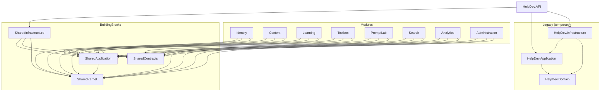

# HelpDev Modular Monolith Architecture

## Why Modular Monolith

HelpDev is a developer platform with several capabilities (identity, CMS, learning, tools, prompts, search, analytics, administration). A **modular monolith** keeps one deployable API and one operational surface while enforcing **bounded context** boundaries inside the codebase.

This gives HelpDev:

- Clear ownership of features without microservice operational cost
- Independent evolution of modules behind stable contracts
- Incremental migration from the existing Clean Architecture MVP
- A path to extract modules later if scale or team boundaries require it

Microservices are deferred until module boundaries and traffic patterns justify them.

## Bounded Contexts

| Module | Responsibility |
|---|---|
| **Identity** | Authentication, users, roles, profiles |
| **Content** | CMS articles/news, publishing workflow, multi-author |
| **Media** | Admin image library, secure upload, public static serving |
| **Learning** | Roadmaps and courses |
| **Toolbox** | Developer tools catalog |
| **PromptLab** | Prompt templates and versions |
| **Search** | Indexing and query APIs |
| **Analytics** | Views, saves, engagement metrics |
| **Administration** | Platform admin operations |

## Allowed Dependency Direction

```
API
 └─► SharedInfrastructure
 └─► Modules (registration only; no cross-module references)
       └─► SharedApplication / SharedContracts / SharedKernel

SharedInfrastructure ─► SharedApplication, SharedContracts, SharedKernel
SharedApplication ─► SharedKernel (, SharedContracts when needed)
SharedContracts ─► SharedKernel (optional)
SharedKernel ─► (none)

Modules must NOT reference:
- HelpDev.API
- Another business module
- Legacy HelpDev.Application / HelpDev.Domain / HelpDev.Infrastructure (until a deliberate migration step)
```

## Domain Events vs Integration Events

| | Domain events | Integration events |
|---|---|---|
| Location | Inside a module aggregate (`IDomainEvent`) | Cross-module / cross-process (`IIntegrationEvent`) |
| Purpose | Capture something that happened in the domain model | Notify other modules or systems after a transaction commits |
| Lifetime | Raised and cleared with the aggregate | Published outward (bus/outbox later) |
| Consumers | Same module handlers (future) | Other modules via contracts |

Domain events stay inside the module boundary. Integration events are the cross-boundary communication mechanism.

## Module Isolation Rules

1. A module **must not** access another module's `DbContext`, EF configurations, or tables directly.
2. Cross-module communication **must** go through:
   - public **Contracts** (DTOs / application contracts published by a module), or
   - **integration events**
3. Shared Kernel holds only truly shared DDD primitives (Entity, Result, etc.), not business rules.

## Incremental Migration Strategy

1. Keep legacy projects (`HelpDev.API`, `HelpDev.Application`, `HelpDev.Domain`, `HelpDev.Infrastructure`) fully active.
2. Introduce BuildingBlocks and empty module skeletons (this step).
3. Migrate **Identity** first (auth, profiles, roles).
4. Migrate **Content** next (CMS kernel).
5. Grow Learning, Toolbox, PromptLab, Search, Analytics, Administration behind new APIs while preserving existing routes.
6. Remove legacy duplicates only after behavior parity and contract tests pass.

Existing controllers, routes, tables, migrations, and connection strings remain unchanged during foundation work.

## Dependency Diagram



## Current Status

- BuildingBlocks and module projects exist.
- **Identity module is migrated** (auth, OTP, JWT, profiles, `CurrentUser`, user persistence adapters).
- **Content module is migrated** (entity, enums, DTOs, services, repository, EF configuration).
- `Program.cs` registers `AddIdentityModule` and `AddContentModule`.
- Existing API routes, JSON contracts, JWT/OTP/content behavior, and DB schema are unchanged.
- Remaining modules are still skeletons / legacy-backed.
